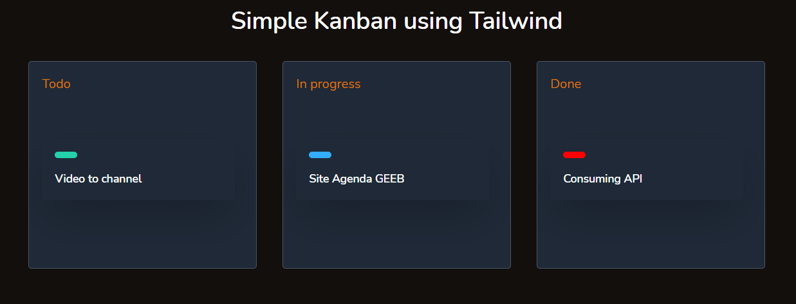

<h1 align="center">
  Simple Kanban using Tailwind
</h1>

  <a href="#-technologies">Technologies</a>&nbsp;&nbsp;&nbsp;|&nbsp;&nbsp;&nbsp;
  <a href="#-project">Project</a>&nbsp;&nbsp;&nbsp;|&nbsp;&nbsp;&nbsp;
  <a href="#-next-steps">Next steps</a>

<h1 align="center">
  
</h1>

---

## 🧪 Technologies

This project was developed using the following technologies:

- [Tailwind](https://tailwindcss.com/)

## 💻 Project

Simple Kanban using Tailwind.

## 🐾 Next steps

###### Escreverei essa parte em português

- [ ] Mudar tema dark/light 😎
- [ ] Utilizar localStorage para salvar o tema escolhido 🎲
- [ ] Utilizar um banco de dados firebase/mongo 📅
- [ ] Ajustar a resposividade do layout 🥰
- [ ] Desenvolver com Electron para poder ver as atividades em Desktop 🐱‍💻
- [ ] E muito mais... ❤💪🏼

---

## 👨🏻‍💻 Author

<h3 align="center">
  
   
  <strong>Elton Santos</strong> 🚀
   
   

 

  

 

Made with ❤️ by Elton Santos 👋🏽 [Entre em contato!](https://www.linkedin.com/in/eltonmelosantos/)

</h3>